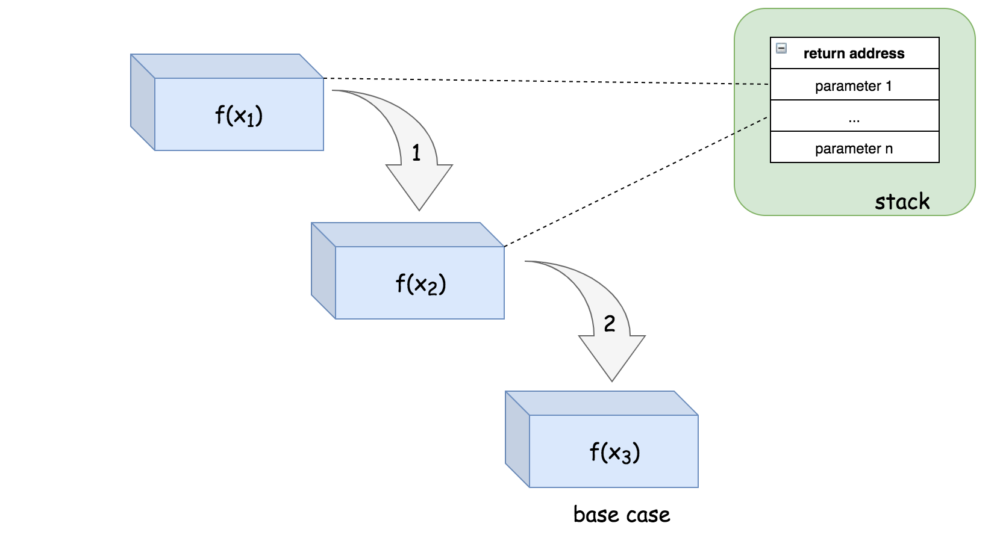

# 学习数据结构与算法的一些笔记--*递归（主要思想和特点）*

## 一、递归需要满足的三个条件

* #### 1.一个问题的解可以分解为几个子问题的解
* #### 2.这个问题与分解之后的子问题，除了数据规模不同，求解思路完全一样
* #### 3.存在递归终止条件

### 举个例子：走台阶
**如果一次只能走一步或两步，需要走完n个阶梯，一共有多少种走法？**
在有n个阶梯时，共有两种走法，即走一步到第n-1个，走两步到第n-2个。所以 n 个台阶的走法就等于先走 1 阶后，n-1 个台阶的走法 加上先走 2 阶后，n-2 个台阶的走法。用公式表示就是：
```
f(n) = f(n-1) + f(n-2)
```
**此处已满足1和2两个条件，还需要分析是否存在边界终止条件**
当还剩2个阶梯时，有两步一次走完和分两次一步走完，即f(2) = 2;还剩1个阶梯时，只有一步一次走完，即f(1) = 1。
**因此，满足三个条件；可以作为递归问题解决：**
```cpp
class solution{
public:
    int FindSteps(n)
    {
        if(n == 2) return 2;
        if(n == 1) return 1;
        return FindSteps(n-2) + FindSteps(n-1);
    }
}
```
## 二、如何实现递归？

* #### 1.递归代码编写
写递归代码的关键就是找到如何将大问题分解为小问题的规律，并且基于此写出递推公式，然后再推敲终止条件，最后将递推公式和终止条件翻译成代码。
* #### 2.递归代码理解
对于递归代码，若试图想清楚整个递和归的过程，实际上是进入了一个思维误区。
那该如何理解递归代码呢？如果一个问题A可以分解为若干个子问题B、C、D，你可以假设子问题B、C、D已经解决。而且，你只需要思考问题A与子问题B、C、D两层之间的关系即可，不需要一层层往下思考子问题与子子问题，子子问题与子子子问题之间的关系。屏蔽掉递归细节，这样子理解起来就简单多了。
因此，理解递归代码，就把它抽象成一个递推公式，不用想一层层的调用关系，不要试图用人脑去分解递归的每个步骤。

## 三、递归常见问题及解决方案

* #### 1.警惕堆栈溢出
可以声明一个全局变量来控制递归的深度，从而避免堆栈溢出。
* #### 2.警惕重复计算
通过某种数据结构来保存已经求解过的值，比如一个hashMap，从而避免重复计算。

## 四、如何将递归改写为非递归代码

笼统的讲，所有的递归代码都可以改写为迭代循环的非递归写法。如何做？抽象出递推公式、初始值和边界条件，然后用迭代循环实现。

## 五、经典题目
### 1.目标和
给定一个非负整数数组，a1, a2, ..., an, 和一个目标数，S。现在你有两个符号 + 和 -。对于数组中的任意一个整数，你都可以从 + 或 -中选择一个符号添加在前面。

返回可以使最终数组和为目标数 S 的所有添加符号的方法数。

 

示例：
```
输入：nums: [1, 1, 1, 1, 1], S: 3
输出：5
解释：

-1+1+1+1+1 = 3
+1-1+1+1+1 = 3
+1+1-1+1+1 = 3
+1+1+1-1+1 = 3
+1+1+1+1-1 = 3

一共有5种方法让最终目标和为3。
```

提示：

数组非空，且长度不会超过 20 。
初始的数组的和不会超过 1000 。
保证返回的最终结果能被 32 位整数存下。

#### 思路：从S开始，可以进行+a[1]/-a[1]两种操作；之后每一个结点都会进行相同的操作。在对a[n]进行操作后，若结果为0，则计数加一；否则直接返回。
```cpp
class Solution {
public:
    int cnt=0;
    // 考虑递归函数，需要传入数组、当前下标idx、当前S
    void solve(int idx, vector<int>& nums, int S)
    {
        // 边界条件，在操作a[n]后
        if(idx == nums.size())
        {
            // 如果S为0，则计数加一
            if(0 == S)
            {
                cnt++;   
            }
            return;
        }
        // 加和减操作
        solve(idx+1, nums, S+nums[idx]);
        solve(idx+1, nums, S-nums[idx]);
    }
    
    int findTargetSumWays(vector<int>& nums, int S) {
        if(S>1000) return 0;
        
        solve(0, nums, S);        
        return cnt;
    }
 };
```
### 2.二叉树的中序遍历
给定一个二叉树，返回它的中序 遍历。

示例:
```
输入: [1,null,2,3]
   1
    \
     2
    /
   3

输出: [1,3,2]
```
#### 思路：从根节点开始，处理左子树、记录根节点、处理右子树；边界条件为，如果节点为NULL，直接返回。
```cpp
/**
 * Definition for a binary tree node.
 * struct TreeNode {
 *     int val;
 *     TreeNode *left;
 *     TreeNode *right;
 *     TreeNode(int x) : val(x), left(NULL), right(NULL) {}
 * };
 */
class Solution {
public:
    vector<int> res;
    
    void solve(TreeNode* r){
        // 边界条件
        if(r == NULL)
        {
            return;
        }
        // 解决左子树
        solve(r->left);
        // 记录根节点值（叶节点可以看做子节点为NULL的根节点）     
        res.push_back(r->val);
        // 处理右子树
        solve(r->right);
    }
    
    vector<int> inorderTraversal(TreeNode* root) {
        solve(root);
        return res;
    }
};
```
---
## 复杂度分析
### 时间复杂度

给出一个递归算法，其时间复杂度O(T) 通常是递归调用的数量（记作R） 和计算的时间复杂度的乘积（表示为O(s)）的乘积：

```O(T)=R∗O(s)```

#### 示例
在反转字符串问题中，解决问题的递归关系可以表示如下：

```printReverse(str) = printReverse(str[1...n]) + print(str[0])```

该函数将被递归调用 n 次，其中 n 是输入字符串的大小。在每次递归结束时，只是打印前导字符，因此该特定操作的时间复杂度是恒定的O(1)。

总而言之，递归函数```printReverse(str)```的总体时间复杂度为```n∗O(1)=O(n)```。

#### 执行树
对于递归函数，递归调用的数量很少与输入的大小呈线性关系。
在这种情况下，最好采用执行树，这是一个用于表示递归函数的执行流程的树。树中的每个节点都表示递归函数的调用。递归函数的执行树将形成$n$叉树，其中$n$作为递推关系中出现递归的次数。因此，树中的节点总数对应于执行期间的递归调用的数量。

斐波那契数问题中，其递推关系被定义为```f(n) = f(n-1) + f(n-2)```。斐波那契函数的执行将形成二叉树。

在 $n$ 层的完全二叉树中，节点的总数为$2^n -1$,因此可以估计 f(n) 的时间复杂度为$O(2^n)$。

#### 记忆化（Memoization）
回到斐波纳契数的例子。通过记忆化技术，我们保存每个索引$n$对应的的斐波那契数的结果，因此每个斐波那契数的计算只会发生一次。而从递推关系来看，斐波纳契数$f(n)$ 将取决于其所有$n-1$个先验斐波纳契数。结果，计算$f(n)$的递归将被调用$n-1$次以计算它所依赖的所有先验数字。

现在，我们可以简单地应用我们在本章开头介绍的公式来计算时间复杂度，即$O(1)∗n=O(n)$。记忆化技术不仅可以优化算法的时间复杂度，还可以简化时间复杂度的计算。

### 空间复杂度
#### 递归相关空间
递归相关空间是指由递归直接引起的内存开销，即用于跟踪递归函数调用的堆栈。为了完成典型的函数调用，系统应该在栈中分配一些空间来保存三个重要信息：

* 函数调用的返回地址。一旦函数调用完成，程序应该知道返回的位置，即函数调用之前的点；
* 传递给函数调用的参数； 
* 函数调用中的局部变量。.
栈中的这个空间是函数调用期间产生的最小成本。然而，一旦完成函数调用，就会释放该空间。

对于递归算法，函数调用将连续链接直到它们到达基本情况（也称为底层情况）。这意味着用于每个函数调用的空间也会累积。对于递归算法，如果没有产生其他内存消耗，则此递归引起的空间将是算法的空间上限。

为了更好地说明这一点，接下来我们将会展示递归调用```f(x1) -> f(x2) -> f(x3)``` 的执行顺序以及栈空间的分配情况。


栈中的空间将会分配给 f(x1) 来调用 f(x2)。类似的情况也同样发生在 f(x2) 中，系统会为 f(x3) 的调用分配另一个空间，最后在 f(x3) 中，我们到达基本情况，因此在 f(x3) 中没有进行进一步的递归调用。

正是由于这些与递归相关的空间消耗，有时可能会遇到称为堆栈溢出的情况，其中为程序分配的堆栈达到其最大空间限制并导致程序最终失败。在设计递归算法时，应该仔细评估在输入规模扩大时是否存在堆栈溢出的可能性。

 

#### 非递归相关空间
正如名称所示，非递归相关空间指的是与递归过程没有直接关系的内存空间，通常包括为全局变量分配的空间（通常在堆中）。

不管是否递归，你都可能需要在任何函数调用之前将问题的输入存储为全局变量。你可能还需要保存递归调用的中间结果。后者就是我们前面提到过的记忆化技术。例如，在使用带有记忆化技术的递归算法解决斐波那契数问题时,我们使用映射（map）来跟踪在递归调用期间产生的所有中间斐波那契数。因此，在分析空间复杂度时，我们应该考虑到因采用记忆化技术所导致的空间成本。

## 尾递归

尾递归函数是递归函数的一种，其中递归调用是递归函数中的最后一条指令。并且在函数中应该只有一次递归调用。
请注意，非尾递归示例中，在最后一次递归调用之后有一个额外的计算。

尾递归的好处是，它可以避免递归调用期间栈空间开销的累积，因为系统可以为每个递归调用重用栈中的固定空间。

例如，对于递归调用序列```f(x1) -> f(x2) -> f(x3)```，如果函数 f(x) 以尾递归的形式实现。那么其执行步骤的顺序和栈空间的分配如下所示：

请注意，在尾递归的情况下，一旦从递归调用返回，我们也会立即返回，因此我们可以跳过整个递归调用返回链，直接返回到原始调用方。这意味着我们根本不需要所有递归调用的调用栈，这为我们节省了空间。

例如，在步骤（1）中，栈中的一个空间将被分配给 f(x1)，以便调用 f(x2)。然后，在步骤（2）中，函数 f(x2) 能够递归地调用 f(x3)，但是，系统不需要在栈上分配新的空间，而是可以简单地重用先前分配给第二次递归调用的空间。最后，在函数 f(x3) 中，我们达到了基本情况，该函数可以简单地将结果返回给原始调用方，而不会返回到之前的函数调用中。