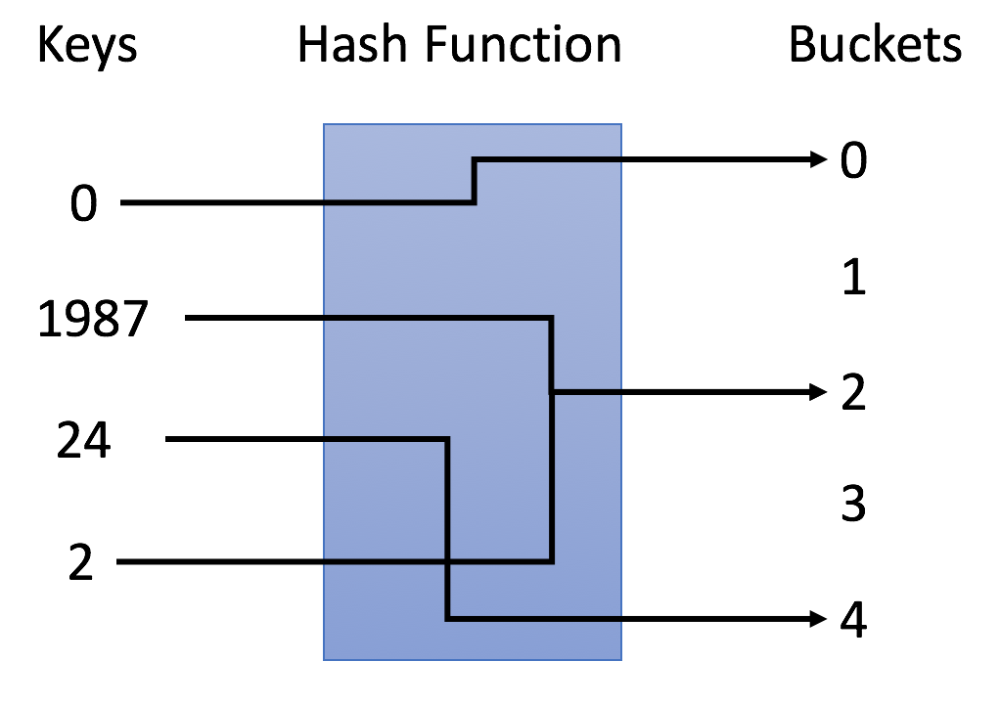

# 学习数据结构与算法的一些笔记--*散列表（概念和特点）*
## 一、散列表
1.散列表来源于数组，它借助散列函数对数组这种数据结构进行扩展，利用的是数组支持按照下标随机访问元素的特性。这样其访问操作时间复杂度为O(1)。
2.需要存储在散列表中的数据我们称为键，将键转化为数组下标的方法称为散列函数，散列函数的计算结果称为散列值。
3.将数据存储在散列值对应的数组下标位置。

## 二、设计散列函数的基本要求

* 1.散列函数计算得到的散列值是一个非负整数。
* 2.若key1=key2，则hash(key1)=hash(key2)
* 3.若key≠key2，则hash(key1)≠hash(key2)

正是由于第3点要求，所以产生了几乎无法避免的散列冲突问题。

比如下图中，使用$ y = x \% 5 $作为哈希函数.


## 三、散列冲突
常用的散列冲突解决方法有2类：**开放寻址法（open addressing）**和**链表法（chaining）.**
### 1.开放寻址法
核心思想：如果出现散列冲突，就重新探测一个空闲位置，将其插入。
#### (1)线性探测法（Linear Probing）：
* 插入数据：当我们往散列表中插入数据时，如果某个数据经过散列函数之后，存储的位置已经被占用了，我们就从当前位置开始，依次往后查找，看是否有空闲位置，直到找到为止。

* 查找数据：我们通过散列函数求出要查找元素的键值对应的散列值，然后比较数组中下标为散列值的元素和要查找的元素是否相等，若相等，则说明就是我们要查找的元素；否则，就顺序往后依次查找。如果遍历到数组的空闲位置还未找到，就说明要查找的元素并没有在散列表中。
* 删除数据：为了不让查找算法失效，可以将删除的元素特殊标记为deleted，当线性探测查找的时候，遇到标记为deleted的空间，并不是停下来，而是继续往下探测。
结论：**最坏时间复杂度为O(n)**
#### (2)二次探测（Quadratic probing）：
线性探测每次探测的步长为1，即在数组中一个一个探测，而二次探测的步长变为原来的平方。
#### (3)双重散列（Double hashing）：
使用一组散列函数，直到找到空闲位置为止。

### 2.链表法（更常用）
* 插入数据：当插入的时候，我们需要通过散列函数计算出对应的散列槽位，将其插入到对应的链表中即可，所以插入的时间复杂度为O(1)。

* 查找或删除数据：当查找、删除一个元素时，通过散列函数计算对应的槽，然后遍历链表查找或删除。对于散列比较均匀的散列函数，链表的节点个数k=n/m，其中n表示散列表中数据的个数，m表示散列表中槽的个数，所以是时间复杂度为O(k)。

### 3.装载因子：
用“装载因子”来表示空位多少，公式：```散列表装载因子=填入表中的个数/散列表的长度```。
装载因子越大，说明空闲位置越少，冲突越多，插入数据会多次寻址或者链表很长，散列表的性能会下降。

* **所以当装载因子触发阈值时，则需要进行动态扩容。** 针对散列表的扩容，数据搬移操作要复杂很多。因为散列表的大小变了，数据的存储位置也可能变了，所以我们需要通过散列函数重新计算每个数据的存储位置。与数组一样，这样的插入操作**均摊复杂度为O(1)。**

* **避免低效的扩容。** 装载因子触达阈值之后，只申请新空间，并不将旧数据搬移到新散列表中。当有新数据要插入时，将新数据插入新散列表中，并且从旧的散列表中拿出一个数据放入到新散列表。经过多次插入操作之后，旧的数据就全部搬移到新散列表中了。这种实现方式，任何情况下，**插入一个数据的时间复杂度都是 O(1)。**

### 4.两种方法的对比和选择
||优点|缺点|适用场合|
|--|--|---|-|
|开放寻址法|1.利用CPU缓存加快查询速度<br>2.序列化起来比较简单 | 1.删除数据需要标记<br>2.装载因子不能太大，更浪费内存空间|**数据量比较小、装载因子小（比如ThreadLocalMap）**|
|链表法|1.内存利用率高<br>2.对大的装载因子容忍度高<br>3.有多种优化方式（红黑树代替链表）|1.存储小对象浪费内存<br>2.零散分布影响效率|**存储大对象、大数据量的散列表**|

## 四、工业级散列表举例分析
何为一个工业级的散列表？工业级的散列表应该具有哪些特性？
* 支持快速地查询、插入、删除操作；
* 内存占用合理，不能浪费过多的内存空间；
* 性能稳定，极端情况下，散列表的性能也不会退化到无法接受的情况。

如何实现这样一个散列表呢？
* 设计一个合适的散列函数；
* 定义装载因子阈值，并且设计动态扩容策略；
* 选择合适的散列冲突解决方法。

### Java 中的 HashMap的应用
#### 1.初始大小HashMap 
默认的初始大小是 16，当然这个默认值是可以设置的，如果事先知道大概的数据量有多大，可以通过修改默认初始大小，减少动态扩容的次数，这样会大大提高 HashMap 的性能。

#### 2.装载因子和动态扩容
最大装载因子默认是 0.75，当 HashMap 中元素个数超过 0.75*capacity（capacity 表示散列表的容量）的时候，就会启动扩容，每次扩容都会扩容为原来的两倍大小。

#### 3.散列冲突解决方法
HashMap 底层采用链表法来解决冲突。即使负载因子和散列函数设计得再合理，也免不了会出现拉链过长的情况，一旦出现拉链过长，则会严重影响 HashMap 的性能。于是，为了对 HashMap 做进一步优化，当链表长度太长（默认超过 8）时，链表就转换为红黑树。可以利用红黑树快速增删改查的特点，提高 HashMap 的性能。当红黑树结点个数少于 8 个的时候，又会将红黑树转化为链表。因为在数据量较小的情况下，红黑树要维护平衡，比起链表来，性能上的优势并不明显。

#### 4.散列函数
散列函数的设计并不复杂，追求的是简单高效、分布均匀。

```java
int hash(Object key) { 
        int h = key.hashCode()； 
        return (h ^ (h >>> 16)) & (capicity -1);//capicity表示散列表的大小其中，hashCode() 返回的是Java对象的hash code
    }
```
可以分为两步来看：
```java
 hash(Object key) {
        int h;
        return (key == null) ? 0 : (h = key.hashCode()) ^ (h >>> 16);
    }
```
这一步叫**扰动函数**，为什么要右移16位再与本身异或呢？
* 首先hashCode()返回值int最高是32位，如果直接拿hashCode()返回值作为下标，大概40亿的映射空间，只要哈希函数映射得比较均匀松散，一般是很难出现碰撞的。但是一个40亿长度的数组，内存是放不下的。
* 用自己的高半区和低半区做异或，混合原始哈希码的高位和低位，关键是以此来加大低位的随机性。为后续计算index截取低位，保证低位的随机性。
* 这样设计保证了对象的hashCode的32位值只要有一位发生改变，整个hash()返回值就会改变，高位的变化会反应到低位里，保证了hash值的随机性。

```java
int index = hash(key) & (capacity - 1)
```
将hash()扰动函数计算的值和hash表当前的容量减一，做按位与运算。
$$A \% B = A \& (B - 1)，当B是2的指数时，等式成立。$$

本质上是使用了「除留余数法」，保证了index的位置分布均匀，位运算更加高效。
**这也是列表长度必须是2的指数幂的原因**。rehash时需要重新计算桶位置，如果不是2的幂，n -1转为二进制后，最低位始终是0，导致最低位为0的桶被浪费，造成更多的hash碰撞。

## 五、散列表和链表
* 散列表的优点：支持高效的数据插入、删除和查找操作
* 散列表的缺点：不支持快速顺序遍历散列表中的数据

我们知道散列表是动态的数据结构，需要频繁的插入和删除数据，那么每次顺序遍历之前都需要先排序，这势必会造成效率非常低下。

### 散列表和链表组合
### 1.LRU（Least Recently Used）缓存淘汰算法
#### 1.1.LRU缓存淘汰算法主要包含3个操作：
①往缓存中添加一个数据；
②从缓存中删除一个数据；
③在缓存中查找一个数据；
**总结：上面3个都涉及到查找。**

#### 1.2.如何用链表实现LRU缓存淘汰算法？
①需要维护一个按照访问时间从大到小的有序排列的链表结构（最新访问的在头部）。
②缓冲空间有限，当空间不足需要淘汰一个数据时直接删除链表头部的节点。
③当要缓存某个数据时，先在链表中查找这个数据。若未找到，则直接将数据放到链表的头部。若找到，就把它移动到链表头部。
④前面说了，LRU缓存的3个主要操作都涉及到查找，若单纯由链表实现，查找的时间复杂度很高为O(n)。**若将链表和散列表结合使用，查找的时间复杂度会降低到O(1)。**

#### 1.3.使用散列表和链表实现LRU缓存淘汰算法
①使用双向链表存储数据，链表中每个节点存储数据（data）、前驱指针（prev）、后继指针（next）和hnext指针（解决散列冲突的链表指针）。
②散列表通过链表法解决散列冲突，所以每个节点都会在两条链中。一条链是双向链表，另一条链是散列表中的拉链。前驱和后继指针是为了将节点串在双向链表中，hnext指针是为了将节点串在散列表的拉链中。
③LRU缓存淘汰算法的3个主要操作如何做到时间复杂度为O(1)呢？
链表本身插入和删除一个节点的时间复杂度为O(1)。
当要查找一个数据时，通过散列表可实现在O(1)时间复杂度找到该数据，再加上前面说的插入或删除的时间复杂度是O(1)，所以我们总操作的时间复杂度就是O(1)。

### 2.Redis有序集合
#### 2.1.什么是有序集合？
①在有序集合中，每个成员对象有2个重要的属性，即key（键值）和score（分值）。
②不仅会通过score来查找数据，还会通过key来查找数据。
#### 2.2.有序集合的操作有哪些？
举个例子，比如用户积分排行榜有这样一个功能：可以通过用户ID来查找积分信息，也可以通过积分区间来查找用户ID。这里用户ID就是key，积分就是score。所以，有序集合的操作如下：
①添加一个对象；
②根据键值删除一个对象；
③根据键值查找一个成员对象；
④根据分值区间查找数据，比如查找积分在[100.356]之间的成员对象；
⑤按照分值从小到大排序成员变量。
这时可以按照分值将成员对象组织成跳表结构，按照键值构建一个散列表。那么上面的所有操作都非常高效。

### 3.Java LinkedHashMap
和LRU缓存淘汰策略实现一模一样。支持按照插入顺序遍历数据，也支持按照访问顺序遍历数据。
实际上，**LinkedHashMap 是通过双向链表和散列表这两种数据结构组合实现的。LinkedHashMap 中的“Linked”实际上是指的是双向链表，并非指用链表法解决散列冲突。**

## 六、思考
### 1.Word文档中单词拼写检查功能是如何实现的？
字符串占用内存大小为8字节，20万单词占用内存大小不超过20MB，所以用散列表存储20万英文词典单词，然后对每个编辑进文档的单词进行查找，若未找到，则提示拼写错误。

### 2.假设我们有10万条URL访问日志，如何按照访问次数给URL排序？
字符串占用内存大小为8字节，10万条URL访问日志占用内存不会很大。通过散列表统计url访问次数，然后根据数据范围确定排序方法（桶排序OR快排），排序后取出url，则为url排序结果。

### 3.有两个字符串数组，每个数组大约有10万条字符串，如何快速找出两个数组中相同的字符串？
将A数组的字符串通过散列函数映射到散列表，散列表中的元素值为次数（或者```bool isExisted```)。然后，遍历B数组，在散列表中进行查找，如果次数>=1（或者```isExisted == True```），则该字符串就是两个数组中相同的字符串。

### 4.上面所讲的几个散列表和链表组合的例子里，我们都是使用双向链表。如果把双向链表改成单链表，还能否正常工作？为什么呢？
单链表中，要删除该结点需要拿到前一个结点的指针，单向链表的查找操作时间复杂度是O(n)，因此总的复杂度会变为 O(n)。

### 5.假设猎聘网有10万名猎头，每个猎头可以通过做任务（比如发布职位）来积累积分，然后通过积分来下载简历。假设你是猎聘网的一名工程师，如何在内存中存储这10万个猎头的ID和积分信息，让它能够支持这样几个操作：
* 1）根据猎头ID查收查找、删除、更新这个猎头的积分信息；
* 2）查找积分在某个区间的猎头ID列表；
* 3）查找按照积分从小到大排名在第x位到第y位之间的猎头ID列表。

以积分排序构建一个跳表，再以猎头 ID 构建一个散列表。
1）ID 在散列表中所以可以 O(1) 查找到这个猎头；
2）积分以跳表存储，跳表支持区间查询；
3）这点根据目前学习的知识暂时无法高效实现。